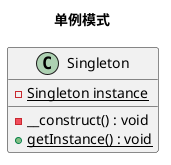

设计模式之单例模式

<!-- MORE -->

## 简介
> 保证一个类仅有一个实例，并提供一个访问它的全局访问点。

## 关键点
- 一个实例
- 全局，多线程、协程
- 一个访问点

## 类图


## 实现
### PHP
- 只需要实现单线程的单例
- 注意__clone()

#### 定义
```PHP
class Singleton {
    private static $instance;
    private function __construct() { }
    private function __clone() { }
    public static function getInstance() {
        if (!isset(self::$instance)) {
            self::$instance = new self();
        }
        return self::$instance;
    }
}
```

#### 使用
```PHP
$single1 = Singleton::getInstance();
$single2 = Singleton::getInstance();

echo $single1 === $single2;
```

#### 结果
```
1
```

## 生成图的代码
### 单例模式

