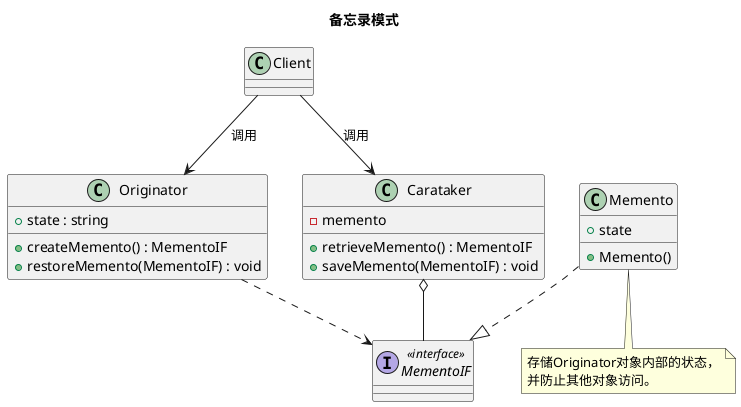

设计模式之备忘录模式

<!-- MORE -->

## 简介
在不破坏封装性的前提下，捕获一个对象的内部状态，并在该对象之外保存这个状态。这样之后就可将该对象回复到原先保存的状态。

## 关键点
- 需要维护或记录历史状态
- 其状态只是众多状态的一小部分

## 类图





## 实现
### PHP
Memento 需要完成的功能：
> 存储Originator对象内部的状态，
> 并防止其他对象访问。

而php的对象，其属性没法有不同的权限。
下面是白盒备忘录的实现。

- 定义

```PHP7
interface MementoIF
{
    public function getState();
}

class Memento implements MementoIF
{
    public $state;

    public function __construct($state)
    {
        $this->state;
    }

    public function getState()
    {
        return $this->state;
    }
}

class Originator
{
    public $state;

    public function createMemento()
    : MementoIF
    {
        return new Memento($this->state);
    }

    public function restoreMemento(MementoIF $mem)
    : void
    {
        $this->state = $mem->getState();
    }
}

class Caretaker
{
    private $memento;
    public function saveMemento(MementoIF $mem) {
        $this->memento = $mem;
    }
    public function retrieveMemento() {
        return $this->memento;
    }
}
```

- 使用

```PHP7
$ori = new Originator();
$ori->state = 'on';

// 备份
$care = new Caretaker();
$care->saveMemento($ori->createMemento());

// 其他操作
$ori->state = 'off';

// 还原
$ori->restoreMemento($care->retrieveMemento());
```
