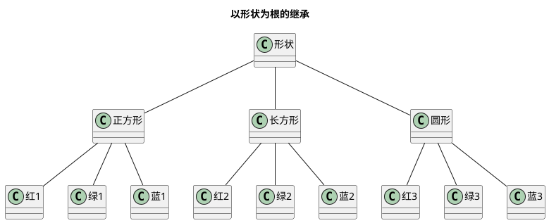
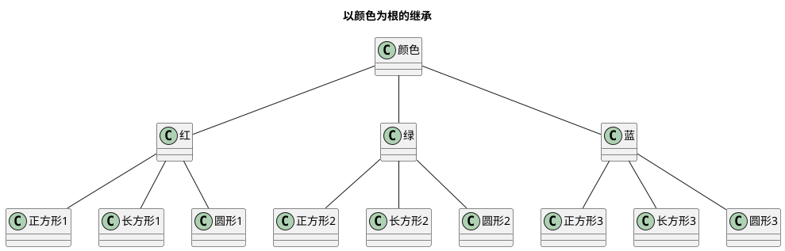
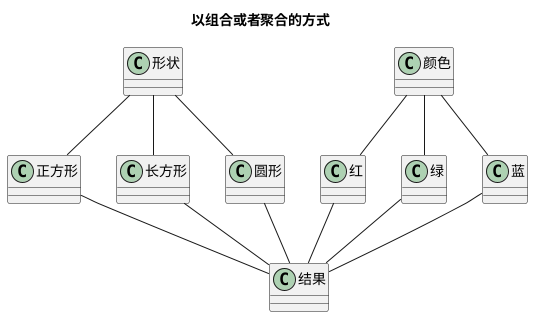

设计模式之桥接模式
<!-- MORE -->

## 简介
> 将抽象部分与它的实现部分分离，使他们都可以独立地变化。

也就是如果实现系统，可以多维度分类，那就能让他们独立变化，以减少耦合。

**多组合**，**少继承** 的体现。

## 关键点
- 可多维度分类
- 多维度分类可以变化
- 可用聚合表示

## 类图


## 实现
### PHP

#### 定义
##### 抽象者
```PHP
abstract class Abstraction {
    /**
     * @var Implementor
     */
    protected $implementor;

    public function setImplementor(Implementor $imp) {
        $this->implementor = $imp;
    }
    abstract public function operation();
}

class RefinedAbstraction extends Abstraction {

    public function operation()
    {
        $this->implementor->operationImp();
    }
}
```

##### 实现者
```PHP
abstract class Implementor {
    abstract public function operationImp();
}
class ConcreteImplementorA extends Implementor {

    public function operationImp()
    {
        echo '具体实现者A', PHP_EOL;
    }
}
class ConcreteImplementorB extends Implementor {

    public function operationImp()
    {
        echo '具体实现者B', PHP_EOL;
    }
}
```

#### 使用
```PHP
$ab = new RefinedAbstraction();
$ab->setImplementor(new ConcreteImplementorA());
$ab->operation();

$ab->setImplementor(new ConcreteImplementorB());
$ab->operation();
```

#### 结果
```
具体实现者A
具体实现者B

```

## 具体例子 🌰
### 题
画图，存在三种图形，三种颜色
- 正方形、长方形、圆形
- 红、绿、蓝

### 使用继承的方式
#### 形状


#### 颜色


#### 问题
很明显，如果再添加形状或者颜色，那会疯掉。

### 以组合或者聚合的方式


使用时，把颜色和图形进行组合。
ok，下面咱们来用桥接模式实现这套方案

### 类图


### PHP
#### 定义
##### 抽象者
```PHP
abstract class Shape {
    /**
     * @var Color
     */
    protected $color;
    public function setColor(Color $color) {
        $this->color = $color;
    }
    abstract public function draw() : void;
}
class Square extends Shape {

    public function draw()
    : void
    {
        echo '正方形，';
        $this->color->paint();
        echo PHP_EOL;
    }
}
class Rectangle extends Shape {

    public function draw()
    : void
    {
        echo '长方形，';
        $this->color->paint();
        echo PHP_EOL;
    }
}
class Circle extends Shape {

    public function draw()
    : void
    {
        echo '圆形，';
        $this->color->paint();
        echo PHP_EOL;
    }
}
```
##### 实现者
```PHP
abstract class Color {
    abstract public function paint() : void;
}
class Red extends Color {

    public function paint()
    : void
    {
        echo '红色';
    }
}
class Green extends Color {

    public function paint()
    : void
    {
        echo '绿色';
    }
}
class Blue extends Color {

    public function paint()
    : void
    {
        echo '蓝色';
    }
}
```
#### 使用
```PHP
$shape = new Circle();
$shape->setColor(new Red());
$shape->draw();

$shape = new Square();
$shape->setColor(new Green());
$shape->draw();

$shape = new Rectangle();
$shape->setColor(new Blue());
$shape->draw();
```
#### 结果
```
圆形，红色
正方形，绿色
长方形，蓝色

```

## 生成图的代码
### 桥接模式
```plantuml
@startuml
Title "桥接模式"

class Client
abstract class Abstraction {
  +{abstract} operation()
}
class refinedAbstraction {
  +operation()
}

abstract class Implementor {
  +{abstract} operationImp()
}

class ConcrateImplementorA {
  +operationImp()
}
class ConcrateImplementorB {
  +operationImp()
}

Client -right--> Abstraction

refinedAbstraction -up--|> Abstraction

ConcrateImplementorA -up--|> Implementor
ConcrateImplementorB -up--|> Implementor

Implementor -left<--o Abstraction
Abstraction -righto--> Implemento


@enduml
```

### 以形状为根的继承


### 以颜色为根的继承


### 以组合或者聚合的方式


### 以组合或者聚合的方式的具体类图
```plantuml
Title "以组合或者聚合的方式的具体类图"

abstract class Shape {
  # color : Color
  + setColor(Color color) : void
  + {abstract} draw() : void
}
class Square {
  + draw() : void
}
class Rectangle {
  + draw() : void
}
class Circle {
  + draw() : void
}

abstract class Color {
  + {abstract} paint() : void
}
class Red {
  + paint() : void
}
class Green {
  + paint() : void
}
class Blue {
  + paint() : void
}

Square -up--|> Shape
Rectangle -up--|> Shape
Circle -up--|> Shape

Red -up--|> Color
Green -up--|> Color
Blue -up--|> Color

Color -right--o Shape
@enduml
```

## 参考
[设计模式读书笔记—–桥接模式](http://cmsblogs.com/?p=357)
