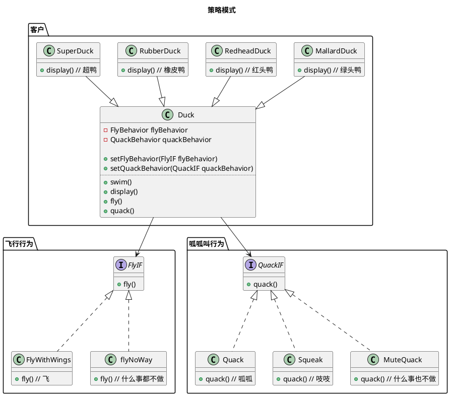

设计模式之策略模式

<!-- MORE -->

## 简介
> 策略模式定义了算法族，分别分装起来，让他们可以相互替换，此模式让算法的变化独立于使用算法的客户。

## 关键点
- 易于变化的部分
- 组合

## 具体例子 🌰
### 题

- 有个游戏有各种鸭子，有游泳、呱呱叫的行为
- 各种鸭子包括
  - 绿头鸭
  - 红头鸭
  - 橡皮鸭
  - 超鸭
- 有些鸭子会飞
- 有些鸭子会叫
- 鸭子都会游泳

## 类图


## 实现
### GO

#### 定义
##### 客户
```GO
type DuckIF interface {
	Fly()
	Quack()
	Swim()
	Display()
}

type Duck struct {
	flyBehavior   FlyIF
	quackBehavior QuackIF
}

func (d *Duck) SetFlyBehavior(flyBehavior FlyIF) {
	d.flyBehavior = flyBehavior
}
func (d *Duck) SetQuackBehavior(quackBehavior QuackIF) {
	d.quackBehavior = quackBehavior
}

func (d Duck) Swim() {
	fmt.Println("游泳")
}
func (d Duck) Fly() {
	d.flyBehavior.Fly()
}
func (d Duck) Quack() {
	d.quackBehavior.Quack()
}

type MallardDuck struct {
	Duck
}

func (d MallardDuck) Display() {
	fmt.Println("绿头鸭")
}

type RedheadDuck struct {
	Duck
}

func (d RedheadDuck) Display() {
	fmt.Println("红头鸭")
}

type RubberDuck struct {
	Duck
}

func (d RubberDuck) Display() {
	fmt.Println("橡皮鸭")
}

type SuperDuck struct {
	Duck
}

func (d SuperDuck) Display() {
	fmt.Println("超级鸭")
}
```

##### 飞行行为
```GO
type FlyIF interface {
	Fly()
}

type FlyWithWings struct {
}

func (f FlyWithWings) Fly() {
	fmt.Println("飞行")
}

type FlyNoWay struct {
}

func (f FlyNoWay) Fly() {
	fmt.Println("啥事也不做，不会飞")
}
```

##### 呱呱叫行为
```GO
type QuackIF interface {
	Quack()
}

type Quack struct {
}

func (q Quack) Quack() {
	fmt.Println("呱呱")
}

type Squeak struct {
}

func (q Squeak) Quack() {
	fmt.Println("吱吱")
}

type MuteQuack struct {
}

func (q MuteQuack) Quack() {
	fmt.Println("静音，不会叫")
}
```

#### 使用
```GO
super := SuperDuck{}
super.SetQuackBehavior(MuteQuack{})
super.SetFlyBehavior(FlyWithWings{})
super.Display()
super.Quack()
super.Fly()

fmt.Println()

rubber := RubberDuck{}
rubber.SetQuackBehavior(Squeak{})
rubber.SetFlyBehavior(FlyNoWay{})
rubber.Display()
rubber.Quack()
rubber.Fly()
```

#### 结果
```
超级鸭
静音，不会叫
飞行

橡皮鸭
吱吱
啥事也不做，不会飞
```

## 生成图的代码
### 策略模式

