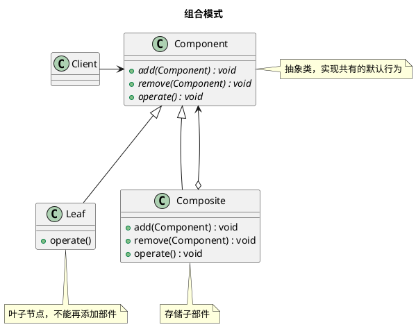

设计模式之组合模式

<!-- MORE -->

## 简介
> 将对象组合成树形结构，以表示“部分-整体”的层次结构。  
> 可以使得单个对象和组合对象的使用，具有一致性。

## 关键点
- 树形
- 部分 - 整体

## 实现方式
- 安全方式
- 透明方式 ： 组合动作公用，无法区分具体的Leaf、Composite

以下为 安全方式

## 类图





## 实现
### PHP
#### 定义
```PHP7
abstract class Component
{
    abstract public function add(Component $component)
    : void;

    abstract public function remove(Component $component)
    : void;

    abstract public function operate(int $depth);

    // 一些能公用的代码
    protected $name = '';

    public function __construct($name)
    {
        $this->name = $name;
    }
}

class Leaf extends Component
{
    public function add(Component $component)
    : void
    {
        throw new \Exception('Cannot add to a leaf');
    }

    public function remove(Component $component)
    : void
    {
        throw new \Exception('Cannot remove from a leaf');
    }

    public function operate(int $depth)
    {
        echo str_pad('', $depth, '-'), $this->name, PHP_EOL;
    }
}

class Composite extends Component
{
    private $components = [];

    public function add(Component $component)
    : void
    {
        $this->components[ spl_object_id($component) ] = $component;
    }

    public function remove(Component $component)
    : void
    {
        unset($this->components[ spl_object_id($component) ]);
    }

    public function operate(int $depth)
    {
        echo str_pad('', $depth, '-'), $this->name, PHP_EOL;
        /** @var Component $component */
        foreach ($this->components as $component) {
            $component->operate($depth + 1);
        }
    }
}
```

#### 使用
```PHP7
$root = new Composite('root');
$root->add(new Leaf('root leaf a'));
$root->add(new Leaf('root leaf b'));

$compA = new Composite('composite a');
$compA->add(new Leaf('composite a leaf c'));
$compA->add(new Leaf('composite a leaf d'));
$compA->add(new Leaf('composite a leaf e'));

$root->add($compA);

$compAA = new Composite('composite aa');
$compAA->add(new Leaf('composite aa leaf f'));
$compAA->add(new Leaf('composite aa leaf g'));
$compAA->add(new Leaf('composite aa leaf h'));

$compA->add($compAA);

$root->operate(0);
```

#### 结果
```
root
-root leaf a
-root leaf b
-composite a
--composite a leaf c
--composite a leaf d
--composite a leaf e
--composite aa
---composite aa leaf f
---composite aa leaf g
---composite aa leaf h
```
