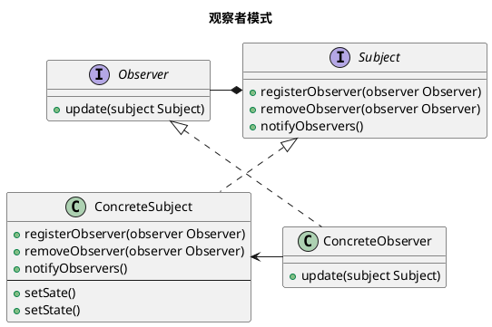

设计模式之观察者模式

<!-- MORE -->

## 简介
> 观察者模式定义了对象之间的一对多依赖，这样一来，当一个对象改变状态时，它的所有依赖者都会收到通知并自动更新。

## 关键点
- 一对多依赖
- 通知

## 类图


## 实现
### GO

#### 定义
```GO
package main

import (
	"container/list"
	"fmt"
)

type Subject interface {
	RegisterObserver(observer Observer)
	RemoveObserver(observer Observer)
	NotifyObservers()
}

type ConcreteSubject struct {
	observers *list.List
	state     int
}

func NewConcreteSubject() *ConcreteSubject {
	s := &ConcreteSubject{}
	s.observers = list.New()
	return s
}

func (s *ConcreteSubject) RegisterObserver(observer Observer) {
	s.observers.PushBack(observer)
}
func (s *ConcreteSubject) RemoveObserver(observer Observer) {
	for ob := s.observers.Front(); ob != nil; ob = ob.Next() {
		if ob.Value.(Observer) == observer {
			s.observers.Remove(ob)
			break
		}
	}
}
func (s *ConcreteSubject) NotifyObservers() {
	for ob := s.observers.Front(); ob != nil; ob = ob.Next() {
		ob.Value.(Observer).Update(s)
	}
}

func (s *ConcreteSubject) SetState(state int) {
	s.state = state
	s.NotifyObservers()
}

func (s *ConcreteSubject) GetState() int {
	return s.state
}

type Observer interface {
	Update(subject Subject)
}

type ConcreteObserver struct {
	Val string
}

func (o *ConcreteObserver) Update(subject Subject) {
	fmt.Println("ConcreteObserver ", o.Val, ":", subject.(*ConcreteSubject).GetState())
}

type ConcreteObserver2 struct {
	Val string
}

func (o *ConcreteObserver2) Update(subject Subject) {
	fmt.Println("ConcreteObserver2 ", o.Val, ":", subject.(*ConcreteSubject).GetState())
}
```

#### 使用
```Go
package main

import (
	"fmt"
)

func main() {
  subject := NewConcreteSubject()
	observer := ConcreteObserver{"1"}
	observer21 := ConcreteObserver2{"21"}
	observer22 := ConcreteObserver2{"22"}

	subject.RegisterObserver(&observer)

	subject.SetState(1)
	fmt.Println()

	subject.RegisterObserver(&observer21)
	subject.RegisterObserver(&observer22)

	subject.SetState(2)
	fmt.Println()

	subject.RemoveObserver(&observer22)
	subject.SetState(3)
	fmt.Println()


	subject.RemoveObserver(&observer)
	subject.RemoveObserver(&observer21)
	subject.RemoveObserver(&observer22)
	subject.RemoveObserver(&observer22)
	subject.SetState(3)
}


```

#### 结果
```
ConcreteObserver  1 : 1

ConcreteObserver  1 : 2
ConcreteObserver2  21 : 2
ConcreteObserver2  22 : 2

ConcreteObserver  1 : 3
ConcreteObserver2  21 : 3

```

## 生成图的代码
### 观察者模式

