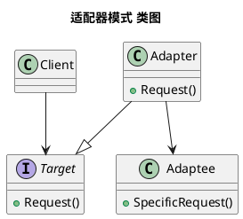

设计模式之适配器模式

<!-- MORE -->

## 简介
将一个类的接口转换成客户希望的另外一个接口。

## 使用条件
- 一般是已存在的类
- 其方法 与 需求有些不符
- 通过加工处理可以完成 需求

## 类图



## 实现
### PHP

- 终端所需知道的
```PHP7
interface Target{
    public function Request();
}
```

- 具体适配器
```PHP7
/**
 * Class 适配器
 * @package App\Maozhua\Libs
 */
class Adapter implements Target {

    private $adaptee;
    public function __construct() {
        $this->adaptee = new Adaptee();
    }

    public function Request()
    {
        $this->adaptee->SpecificRequest();
    }
}
```

- 适配的对象
```PHP7
/**
 * Class 适配的对象
 * @package App\Maozhua\Libs
 */
class Adaptee {
    public function SpecificRequest() {

    }
}
```

- 使用
```PHP7
$target = new Adapter();
$target->Request();
```
